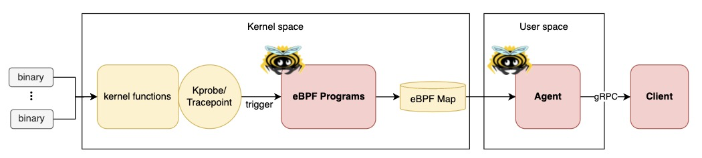

# Tetragon-mini
Security Observation Tool written in Rust aya framework inspired by Tetragon.🦀🐝



## Why "mini"?
- Compared to Tetragon, it has a smaller binary size (because it's written in Rust)
- It has fewer features compared to Tetragon.

## Process Lifecycle Monitoring
Now, tetragon-mini can monitor process lifecycle like bellow:
```
🚀 process      101708: root: /usr/sbin/iptables
💥 exit         101708: root: /usr/sbin/iptables
🚀 process      101705: yukinakamura: /usr/bin/cat
💥 exit         101705: yukinakamura: /usr/bin/cat
🚀 process      101758: yukinakamura: /usr/bin/sed
💥 exit         101758: yukinakamura: /usr/bin/sed
```

## How to run
### Prerequisites
- Linux
- Rust nightly
- [bpf-linker](https://github.com/aya-rs/bpf-linker)
- [bindgen-cli](https://rust-lang.github.io/rust-bindgen/command-line-usage.html)

### Set up Lima VM on MacOS
If you're using MacOS, you can quickly set it up with lima and my template.
```
lima start lima/tetragon-mini.yaml
```

### Build and Run
- Run the next command to generate the necessary Struct codes
```
cargo xtask codegen
```
- Build and Run eBPF Programs and Agent
```
cargo xtask run
```
- Build and Run client
```
cargo run --bin tetra
```

## Blog Posts
- [Tetragon-mini by Rust: eBPF-based process monitoring](https://yuki-nakamura.com/2024/12/27/tetragon-mini-by-rust-ebpf-based-process-monitoring/)
